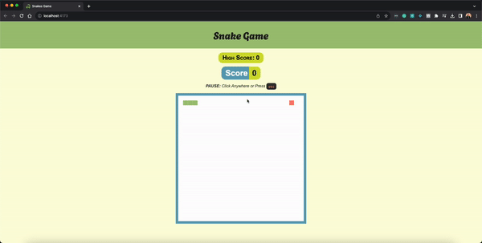

# Snake Game 🐍




A classic Snake game built using React.js, HTML Canvas, and TypeScript.

## Table of Contents

- [Demo](#demo)
- [Features](#features)
- [Getting Started](#getting-started)
- [Game Controls](#game-controls)
- [License](#license)

## Demo

You can play the game online at [Snake Game Demo](https://snakes-game-nine.vercel.app/).

## Features

- Classic Snake gameplay.
- Built with React.js and HTML canvas.
- No third-party libraries used.
- TypeScript for type safety.
- Responsive design.
- Score tracking.
- Saves HighScore
- Game over screen with the option to restart.
- Keyboard controls for navigation.

## Getting Started

To run the game locally, follow these steps:

1. Clone this repository:

   ```shell
   git clone git@github.com:<your-user-name>/snakes-game.git
   ```

2. Navigate to the project directory:

   ```shell
   cd snake-game
   ```

3. Install the required dependencies. Yarn is recommended:

   ```shell
   yarn
   ```

4. Run the build script:

   ```shell
   yarn build
   ```

5. Start the game by serving the build output:

   ```shell
   yarn preview
   ```

**NOTE**: The development environment causes the components to re-render, causing the game logic for the canvas to be duplicated and appear buggy. That's why it's recommended to build the app and run the build output to avoid the re-renders.

## Game Controls

Use the arrow keys or `W`,`A`,`S`,`D` keys on your keyboard to control the snake's direction:

- ↑ (Up) or `W` - Move Up
- ↓ (Down) or `S` - Move Down
- ← (Left) or `A` - Move Left
- → (Right) or `D` - Move Right

Others:

- To **Pause** the game - Press `esc` or click anywhere the screen

## License

This project is licensed under the MIT License - see the [LICENSE](./LICENSE) file for details.
